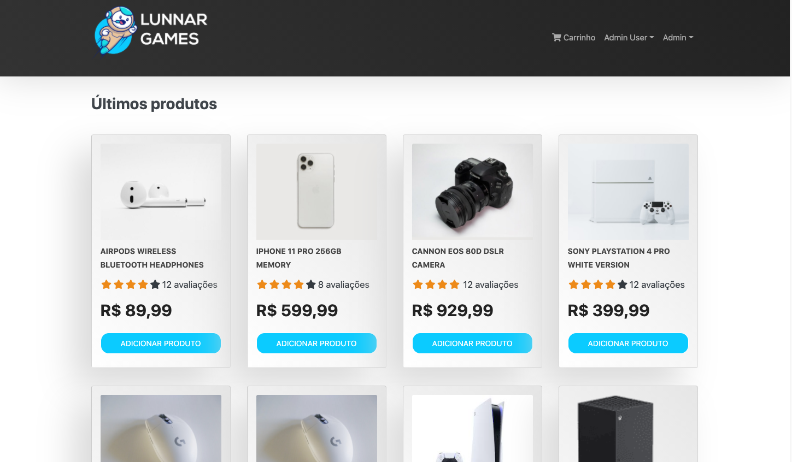

# Lunnar Games Ecommerce

 

 
Projeto MEARN (Mongo, Express, React e Node) para construação de e-commerce completo junto com o gerenciamento de pedidos.

## 

## Funcionalidades

- Carrinho totalmente funcional
- Reviews de produtos e avaliação
- Principais produtos no carrosel
- Páginação de produtos
- Busca de produtos
- Perfil de usuário com pedidos
- Admin product management
- Admin user management
- Admin Order details page
- Opção de marcar pedidos como entregue
- Processo de finalização de pedido (shipping, payment method, etc)
- PayPal / integração cartão de crédito
- Database seeder (products & users)

## Variaveis Ambiente

Criar um .env arquivo e adicionar:

´NODE_ENV = development
PORT = 5000
MONGO_URI = your mongodb uri
JWT_SECRET = 'abc123'
PAYPAL_CLIENT_ID = your paypal client id´

